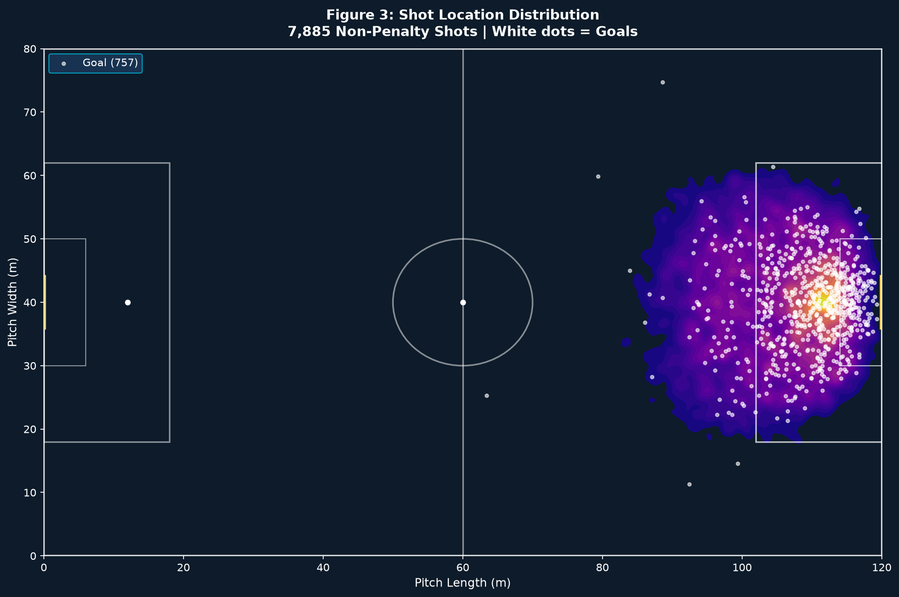

# xG Beyond Event Data: Spatiotemporal Tracking & Machine Learning in Football Shot Quality Modelling

**Rafeh Islam**<br>
University of Amsterdam, MSc Econometrics | Data Analytics<br>
Thesis supervisor: Hans van Ophem

> To what extent does incorporating the positions of all players at the moment of the shot, and up to 10 seconds before it, alongside possession-sequence context, improve xG predictions, and which machine learning approach benefits most?

## TL;DR

<p align="center">
  
</p>

- **7,885 shots** across 5 competitions, using StatsBomb 360 freeze-frame (tracking) data
- Adding tracking data improves discrimination: AUC improves from 0.826 to 0.841 over an event-data-only baseline
- Best model (tuned ElasticNet logistic regression, combined tracking and temporal features) achieves an **AUC of 0.850**, which is 98% of StatsBomb's commercial xG model's discriminative performance, using only open data
- Performance differences validated with bootstrapped confidence intervals and DeLong tests (Holm-Bonferroni corrected)
- **SHAP analysis** shows temporal features dominate in the best logistic regression, while tracking features dominate in Random Forest, despite identical feature sets, indicating the marginal value of each data stream depends materially on model architecture
- Applied case study: a Poisson aggregation model on the 2023/24 Bundesliga season, going from shot-level xG to match outcome probabilities

## Why this matters

Most public xG models rely on event data alone (shot location, angle, body part, assist type). This ignores something coaches and scouts care about deeply: where every other player was positioned, how the play developed in the seconds before the shot, and the possession sequence that created the chance. This thesis builds a reproducible, statistically robust framework, using only open data, to test how much this richer spatiotemporal context actually adds, and which model families are best positioned to exploit it.

## Repo structure

```
xg-thesis/
├── xg_analysis.ipynb           # full pipeline: features, models, SHAP, DeLong tests, betting case study
├── notebooks/
│   └── sb_data_extraction.ipynb # supplementary notebook to independently load and process data from the StatsBomb Open Data Python library, producing the checkpoint used by xg_analysis.ipynb
├── thesis.pdf                  # full written thesis
└── requirements.txt
```

## Data

This project uses:
- **[StatsBomb Open Data](https://github.com/statsbomb/open-data)** (event and 360 tracking data), accessed via `statsbombpy`. Per StatsBomb's [Public Data User Agreement](https://github.com/statsbomb/open-data/blob/master/LICENSE.pdf), this data is not redistributed, modified copies are not redistributed, and is not used commercially; the notebook pulls it directly and live from StatsBomb's public repo. The agreement also requires accreditation with the StatsBomb brand logo (see below).
- **[football-data.co.uk](https://www.football-data.co.uk/)** Bundesliga odds data, used for the applied case study.

<p align="left">
  
</p>

*Data provided by StatsBomb.*

## Methodology (short version)

1. **Feature engineering**: baseline event features, freeze-frame tracking features (defender positions, GK positioning, pressure), and novel temporal possession-sequence features, for a combined set of 82 variables
2. **Models**: Logistic Regression / ElasticNet, Random Forest, XGBoost, LightGBM, CatBoost, evaluated untuned and tuned, across 4 feature conditions
3. **Evaluation**: AUC, log-loss, calibration, with bootstrapped confidence intervals and DeLong tests (Holm-Bonferroni corrected) for statistically valid pairwise model comparison
4. **Interpretation**: SHAP values across model families to see how feature importance shifts by architecture
5. **Applied validation**: a Poisson aggregation model mapping shot-level xG to match outcome probabilities, benchmarked against Bundesliga bookmaker odds

Full detail in [`thesis.pdf`](./thesis.pdf).

<p align="center">
  
</p>

## Reproducing this

`xg_analysis.ipynb` runs from the provided checkpoint file, which is not distributed in this repo (see Data section). To reproduce it end-to-end:

```bash
git clone https://github.com/Rafeh-I/xg-thesis.git
cd xg-thesis
pip install -r requirements.txt

# Step 1: regenerate the dataset from raw StatsBomb data (pulls live via statsbombpy)
jupyter notebook notebooks/sb_data_extraction.ipynb

# Step 2: run the full modelling pipeline on the resulting dataset
jupyter notebook xg_analysis.ipynb
```

## Tech stack

`Python` · `scikit-learn` · `XGBoost` · `LightGBM` · `CatBoost` · `SHAP` · `statsbombpy` · `pandas` / `numpy` · `scipy`

## Contact

Rafeh Islam. [LinkedIn](https://linkedin.com/in/rafeh-islam) · rafeh.212@gmail.com
